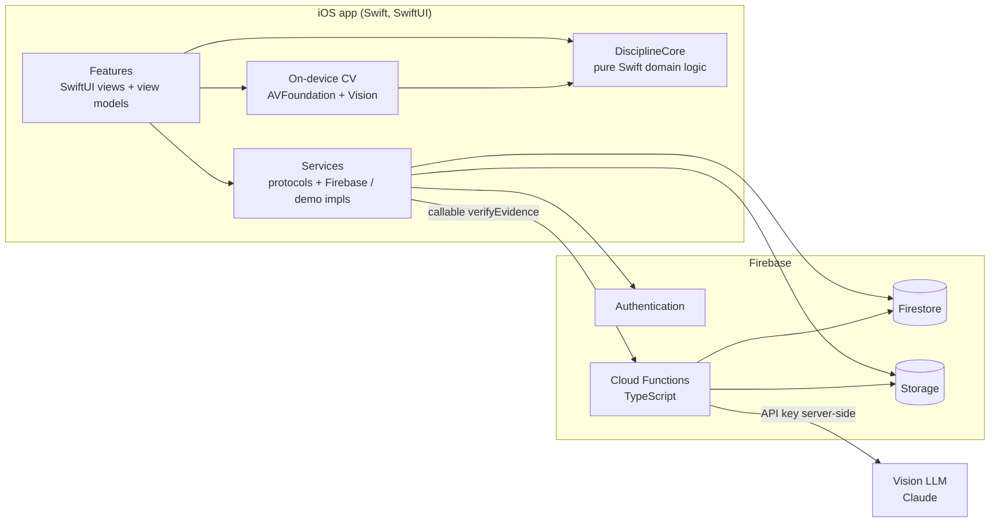
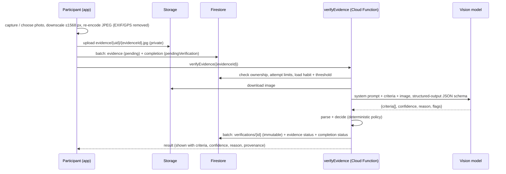
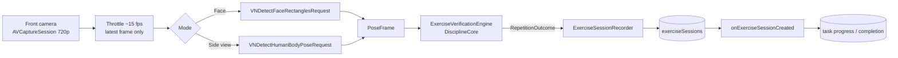
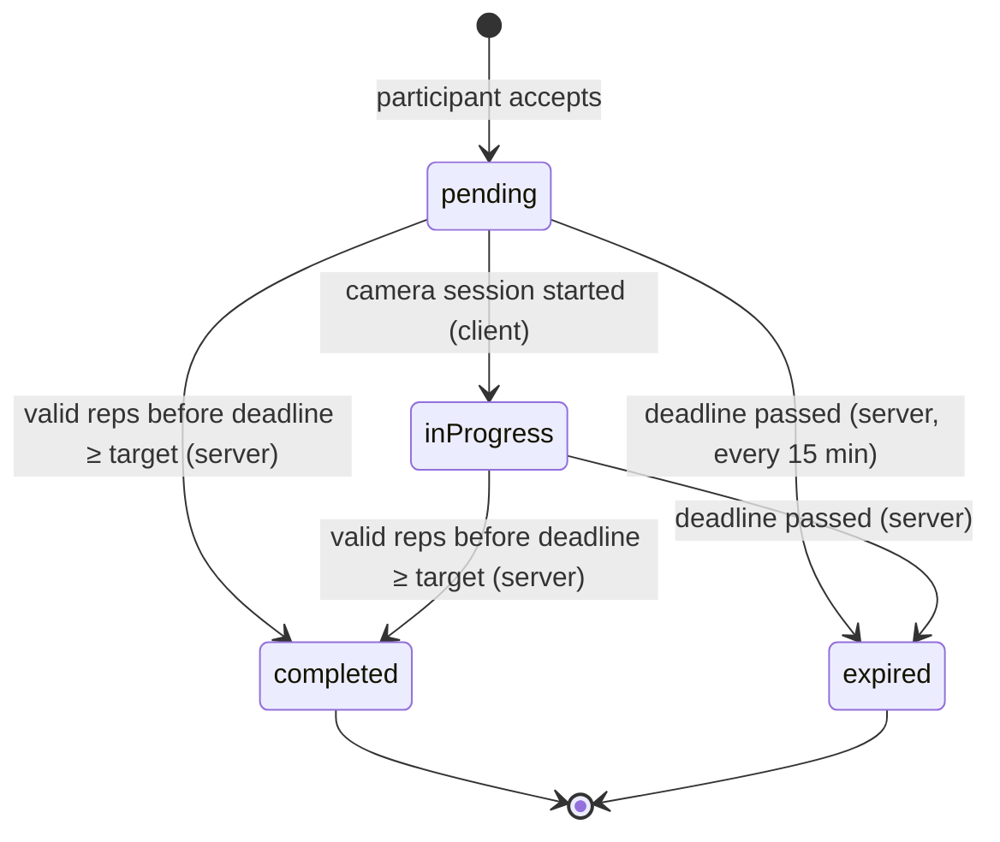

# Discipline: Technical Documentation

This document describes the design and implementation of *Discipline*, the iOS application built as the practical part of a thesis on whether **AI-assisted evidence verification improves adherence and accountability compared with conventional self-reported habit tracking**. It is written to be cited and adapted in the thesis. Source locations are given so every claim can be traced to code and tests.

**Product model.** The app runs as a single 90-day challenge: a fixed weekly routine (workouts, runs, optional extras) plus two new skills practised for at least 60 minutes every day. Every main activity is proven with a photo assessed by AI; an unfinished day resets the streak to 0 unless the activity was skipped and the skip resolved with camera-counted push-ups (§6.6).

Contents

1. [System architecture](#1-system-architecture)
2. [AI photo verification pipeline](#2-ai-photo-verification-pipeline)
3. [Exercise computer-vision pipeline](#3-exercise-computer-vision-pipeline)
4. [Database design](#4-database-design)
5. [Authentication and security](#5-authentication-and-security)
6. [Streak algorithm](#6-streak-algorithm)
7. [Accountability algorithm](#7-accountability-algorithm)
8. [Research data model](#8-research-data-model)
9. [Experimental comparison: manual vs. AI-assisted](#9-experimental-comparison-manual-vs-ai-assisted)
10. [Verification and testing](#10-verification-and-testing)
11. [Limitations and threats to validity](#11-limitations-and-threats-to-validity)

---

## 1. System architecture

### 1.1 Overview



The system has three tiers:

| Tier | Technology | Responsibility |
|---|---|---|
| **Domain core** | `Packages/DisciplineCore`, a Swift package that depends only on Foundation | Models; habit scheduling and targets; day resolution and streaks; accountability lifecycle; AI verification decision policy; repetition state machines; research records, aggregation and CSV; notification planning; progress statistics |
| **iOS app** | `Discipline/`: SwiftUI, Observation, MVVM, iOS 17+ | Presentation, camera and Vision integration, persistence adapters, dependency injection |
| **Backend** | Firebase Auth, Firestore, Storage; Cloud Functions (`firebase/functions`, TypeScript, Node 22) | Identity; authoritative storage; server-only decisions (AI verification, task completion and expiry, condition assignment, research records); security rules |

### 1.2 Design principles

1. **Pure, testable domain logic.** Every rule that affects research outcomes (what counts as a day's success, a valid repetition or a verified photo) is a deterministic function in `DisciplineCore`. It has no UI, network or clock dependencies (time is passed in), and is covered by unit tests.
2. **Server authority for research-relevant outcomes.** The client can *request* but never *decide* verification results, task completion or expiry, experimental condition, or research records. The security rules make this unbypassable (§5).
3. **One definition, two runtimes, shared test vectors.** When logic must run both on the device and on the server (the AI decision policy and the day/streak resolver), it is implemented in Swift and TypeScript. Both implementations run the same JSON test vectors, so they cannot silently diverge (§10).
4. **Replaceable providers.** AI verification sits behind `AIVerificationService` (client) and `VisionProvider` (server). Exercise analysis sits behind `ExerciseVerificationEngine` and `PoseSource`.
5. **Local-first writes.** User actions are written to Firestore's persistent cache immediately and synchronized in the background. Server acknowledgement and failures are tracked (`SyncMonitor`) and shown, never swallowed.

### 1.3 Composition and dependency injection

`AppContainer` (`Discipline/App/AppContainer.swift`) is the composition root. It builds either the Firebase implementation of every service (when `GoogleService-Info.plist` is bundled) or a demo implementation that stores data on the device. Views receive services through the SwiftUI environment. `HabitsStore` holds the signed-in participant's live state (habits, completions, tasks, challenges, streak) and delegates all calculations to `DisciplineCore`.

### 1.4 Module map

```text
Discipline/
  App/                 DisciplineApp, AppContainer
  Core/                configuration, design system, Firebase bootstrap, computer vision
                       (PoseCamera, PoseSource), notifications, persistence (sync, connectivity)
  Services/            Authentication, Users, Habits, Evidence (+ AI verification),
                       Accountability, Exercise, Challenges, Research (+ SUS), Widget, Performance
  Features/            Authentication, Onboarding, Dashboard, Habits, Evidence, Accountability,
                       ExerciseCamera, Streak, Challenges (90-day setup), Progress, Profile,
                       Settings (+ Performance), Research (+ SUS questionnaire)
DisciplineWidget/      WidgetKit extension: renders the WidgetSnapshot written by the app
Packages/DisciplineCore/Sources/DisciplineCore/
  Models/  Time/  Habits/  Verification/  Accountability/  Exercise/  Streaks/
  Challenges/ (incl. RoutinePlanner)  Research/ (incl. SUS, performance)  Progress/
  Notifications/  Widget/  Demo/  Validation/
firebase/
  firestore.rules  storage.rules  firestore.indexes.json
  functions/src/   verify, policy, prompt, providers/, accountability, research/
```

---

## 2. AI photo verification pipeline

### 2.1 Principle

The AI is never asked the open question *"did this person do the activity?"*. Instead, each habit category has explicit **visual criteria** (e.g. *"Is exercise equipment visible?"*). The model only **answers each criterion** and states its confidence. A **fixed, published decision rule** turns the answers into an outcome. Every input, criterion, output, confidence value and decision is stored.

### 2.2 Flow



### 2.3 Criteria

Criteria are defined once in `Packages/DisciplineCore/Sources/DisciplineCore/Resources/verification-criteria.json` (`criteria-v1`). The app bundles this file to show participants *what will be checked* before they submit, and the Cloud Function build copies the same file, so both always use identical criteria. Every category starts with a shared authenticity criterion ("genuine camera photograph, not a screenshot or stock image") followed by category-specific criteria. For example, the gym criteria are a workout environment, visible equipment, and relevance to the declared activity.

### 2.4 Prompt and structured output

`firebase/functions/src/prompt.ts` (`prompt-v1`):

- **System prompt.** Instructs the model to judge only what is visible, not to infer completion, duration or time, to lower its confidence for ambiguous images, not to describe people's appearance or identity, and to treat the participant's habit text as data, not instructions (prompt-injection defence).
- **User content.** The image plus the declared activity in a delimited block (name ≤ 60 characters, description ≤ 200) and the numbered criteria with their IDs.
- **Structured output.** A JSON schema (`output_config.format`). Criterion IDs and flags are restricted to enumerations, and additional properties are forbidden.
- **Provider** (`providers/anthropic.ts`): `claude-opus-5` (configurable via `VERIFICATION_MODEL`), low effort (a classification task), a 60 s timeout, one retry, and server-side refusal fallback. The model that actually served the request is recorded.

### 2.5 Decision policy

Implemented identically in `VerificationPolicy.swift` and `policy.ts`:

```text
parse(response):  must be JSON with criteria[{id, passed}], confidence (number), reason, flags[]
                  otherwise → error "malformed_response"
decide(assessment, criteria, threshold):
  if confidence ∉ [0, 1]                                  → malformed_response
  if any defined criterion unanswered, or answered twice
     with conflicting values                              → malformed_response
  unknown extra criteria are ignored and flagged "unexpected_criterion"
  if confidence < threshold                               → UNCERTAIN
  else if every required criterion passed                 → VERIFIED
  else                                                    → REJECTED
```

- The default threshold is **0.70**. Challenges can set it, but participants can't; it's a locked study parameter.
- Low confidence always yields *uncertain*, whatever the answers were, so the system never guesses.
- How *uncertain* counts toward adherence is a challenge rule (`countsAsResolved` by default) and is recorded.

### 2.6 Failure handling and history

| Situation | Recorded as | Completion |
|---|---|---|
| Timeout / network | `status: error`, `errorCode: timeout` | stays `pendingVerification` (retryable) |
| Rate limit | `error`, `rate_limited` | retryable |
| Provider error | `error`, `provider_error` | retryable |
| Safety refusal (after fallback) | `error`, `refusal` | retryable |
| Malformed model output | `error`, `malformed_response` | retryable |
| Decided | `verified` / `rejected` / `uncertain` + confidence | set accordingly |

Every attempt is written once to `verifications/{id}` with: participant, habit, evidence, timestamp, provider, served model, `promptVersion` (`criteria-v1/prompt-v1`), per-criterion results, status, confidence, threshold, reason, flags, processing time and error code. Records are **never updated**; a retry creates a new record. Limits: 3 attempts per photo, and 30 AI calls per participant per 24 h (cost and abuse protection). Evidence that has already been decided returns its stored result without calling the model again.

### 2.7 Wording

The app never claims proof. Results read *"AI verification indicates that the submitted evidence satisfies the defined criteria"*, show confidence against the threshold, and carry the note *"Automated assessment. It can be wrong and is not proof of what happened."*

---

## 3. Exercise computer-vision pipeline

### 3.1 Purpose and separation

This is a separate system from photo verification (spec §51). It decides whether the participant performed a required number of **valid repetitions**, entirely **on the device**. No video is recorded or uploaded; only repetition events are stored.

### 3.2 Pipeline



`PoseFrame` carries normalized landmarks (or a face box), confidence values and the image aspect ratio. Engines implement:

```swift
protocol ExerciseVerificationEngine {
  var exercise: ExerciseKind { get }
  var method: ExerciseVerificationMethod { get }   // stored with each session
  var version: String { get }                       // thresholds version, stored
  mutating func reset()
  mutating func process(_ frame: PoseFrame) -> ExerciseUpdate
}
```

### 3.3 Face mode (default, `pushup-face-v1`)

The phone lies flat under the participant's face, screen up. Face height grows as the participant descends.

1. **Calibration.** 12 consecutive steady frames at the top position (each within ±12 % of the running mean, face height between 6 % and 45 % of the frame). Their mean becomes the reference *h₀*.
2. **Signal.** *r = EMA(h) / h₀*, where EMA is an exponential moving average with α = 0.5. At the top the reference slowly follows small posture drift (5 %).
3. **State machine.**

```text
up   ──(r ≥ 1.25)──▶ down        down ──(r ≤ 1.20)──▶ up (+ judge repetition)
valid rep:   max r ≥ 1.60
ignored:     max r < 1.35 (wobble)
faults:      insufficientDepth (1.35 ≤ max r < 1.60)
             incompleteLockout (after bottom, r ≤ 1.40 then ≥ 1.60 again without reaching 1.20)
             trackingLost (face missing > 1 s mid-rep)
```

Face mode verifies depth and lockout but **cannot verify body straightness**. It was introduced after real-world testing showed the side view was hard to set up (§11).

### 3.4 Side-view mode (strict, `pushup-v1`)

The phone stands about 2 m to the side. The more confident body side is used.

- **Calibration gate:** 10 consecutive frames with shoulder, elbow, wrist, hip and ankle detected (confidence ≥ 0.3), none within 2 % of the frame edge, body span ≥ 25 % of the frame width, shoulder→ankle tilt ≤ 40°, and mean confidence ≥ 0.5.
- **Aspect correction:** x coordinates are scaled by the image aspect ratio before measuring angles. Vision normalizes each axis independently, and without this correction angles in a portrait frame are distorted (a 90° angle measures ≈ 53° at a 1:2 aspect ratio; tested).
- **Signals:** the elbow angle ∠(shoulder, elbow, wrist), smoothed with an EMA (α = 0.5), and the body line ∠(shoulder, hip, ankle).
- **State machine:** `up` at ≥ 150° → `down` when < 140° → the rep is judged on returning to ≥ 150°.
  - **Valid:** the bottom (≤ 95°) was reached and the body line stayed ≥ 150°.
  - **Ignored:** a minimum angle > 130° (a wobble).
  - **Faults:** `insufficientDepth`, `incompleteLockout` (bounce above 120° and back below 95° without lockout), `bodyNotStraight`, `trackingLost`.

### 3.5 Session and task resolution

`ExerciseSessionRecorder` records each repetition (index, time, valid/fault, min/max of the metric; `metric` names its meaning: `elbow_angle_degrees` or `face_size_ratio_to_top`). The session target is the task target minus earlier valid reps. When stored, the `onExerciseSessionCreated` function sums valid repetitions of sessions **completed before the deadline**. It uses the *earlier* of the client end time and the **server receive time**, so a session can't be backdated. The task is completed when the target is reached.

### 3.6 Anti-cheating measures

The design makes simple cheating harder but does not claim to make it impossible. Measures in place:
- a live camera with continuous tracking, where losing tracking for more than 1 s aborts the rep
- the calibration gate
- per-repetition movement thresholds
- session timestamps checked against server time
- security rules that bound session values (valid reps ≤ target ≤ 150)

---

## 4. Database design

### 4.1 Collections

| Collection | Document ID | Written by | Key fields |
|---|---|---|---|
| `users` | auth uid | client (+ server assignment) | `participantId` (random, `P-XXXXXXXXXX`), `trackingCondition`, `conditionAssignedBy/At`, `timeZone`, consent timestamps |
| `habits` | UUID | client | `userId`, `challengeId?`, `frequency` (daily/weekly/custom), `unit`, `targetCount`, `scheduledWeekdays`, `startDate`/`endDate` (DayKey), `requiresEvidence`, `isRequired`, `skipConsequence`, `isActive` |
| `habitCompletions` | `{habitId}_{day}_{index}` (sessions) or UUID (amounts) | client + server | `day` (participant-local `yyyy-MM-dd`), `quantity`, `status` (10 states), `method`, `trackingCondition` (copied), `evidenceId?`, `verificationId?`, `accountabilityTaskId?`, `clientRequestId` |
| `evidence` | UUID | client (create) + server (status) | `storagePath`, `captureSource` (camera/library), `verificationStatus`, `verificationResultId` |
| `verifications` | UUID | **server only** | see §2.6; immutable |
| `accountabilityTasks` | UUID | client (create/start) + **server** (complete/expire) | `sourceHabitId`, `sourceCompletionId`, `day`, `type`, `target`, `progress`, `status`, `acceptedAt`, `deadline` |
| `exerciseSessions` | UUID | client (create once) | `accountabilityTaskId`, `exercise`, `verificationMethod`, `engineVersion`, `targetReps`, `validReps`, `invalidReps`, `outcome`, `repetitions[]` |
| `challenges` | UUID | client | `durationDays`, `startDate`/`endDate`, `rules` (locked once active), `status`, `rulesAcceptedAt`, `templateId` |
| `dailyRecords` | `{participantId}_{day}` | **server only** | see §8 |
| `usabilityResponses` | UUID | client (create once) | `participantId`, `trackingCondition`, `questionnaireVersion`, `responses[10]`, `score`, `challengeDay`, `submittedAt`; no account ID (§8.5) |
| `research/assignment` | fixed | **server only** | permuted-block state |

### 4.2 Design decisions

- **Participant-local day keys.** Completions store the calendar day on which they happened in the participant's time zone. The analysis never reconstructs days from timestamps.
- **Status instead of Boolean.** A completion moves through `pending`, `selfReported`, `pendingVerification`, `verified`, `rejected`, `uncertain`, `skipped`, `accountabilityRequired`, `resolved` and `failed`, so the data records *how* a commitment was met, not just whether it was.
- **Condition copied onto events.** Condition is stored on each completion and each daily record, so no joins are needed at analysis time.
- **Deterministic session completion IDs.** Offline retries or double taps land on the same document, so completions can't be duplicated.
- **Append-only verification history.** Verification results and exercise sessions are never modified.
- **Composite indexes** (`firestore.indexes.json`) cover every compound query: completions by (userId, day), tasks by (userId, status, deadline) and (status, deadline), verifications by (userId, timestamp), and daily records by (participantId, day).

---

## 5. Authentication and security

### 5.1 Authentication

- **Accounts:** Firebase Authentication (email/password) with registration, login, logout, password reset and persistent sessions. The app never stores passwords.
- **Profiles:** created lazily on first sign-in.
- **Researchers:** the `researcher: true` custom claim, which only the Admin SDK can grant (`scripts/set-researcher-claim.js`).
- **Demo mode:** a local stand-in that is explicitly not a security boundary. It is never active when Firebase is configured.

### 5.2 Authorization (security rules)

The rules are in `firebase/firestore.rules` and `firebase/storage.rules`, with 24 emulator tests in `firebase/tests`.

| Asset | Rule |
|---|---|
| Private documents | Readable only when `userId` equals the caller's uid; queries must be scoped to the caller |
| Profile | Condition, participant ID and assignment fields immutable for clients; clients can't claim a server assignment |
| Completions | Must reference the caller's own habit; clients can set only `pending`/`selfReported`/`pendingVerification`/`skipped`/`accountabilityRequired`; **server-decided statuses are final** for the client; the condition must match the profile; **in the AI-assisted condition, evidence-required habits cannot be self-reported** |
| Evidence | Created as `pending` at the caller's own storage path; status fields server-only |
| Verifications | Read own; no client writes |
| Accountability tasks | Created `pending` with target ≤ 150 and deadline ≤ creation + 48 h; clients may only start them; completion/expiry server-only; deadline can't be extended; progress can't be written |
| Exercise sessions | Write-once; tied to the caller's own task; valid reps ≤ target ≤ 150 |
| Challenges | Rules, dates and duration locked once active; lifecycle can't be reversed |
| Habits in an active challenge | Commitment fields (target, frequency, unit, weekdays, start date, required, evidence) locked, so past days can't be re-scored |
| Daily records | Researchers read all; participants read their own; no client writes |
| Usability responses | Create-only with the caller's own participant ID and condition, ten answers each 1–5, score 0–100, no account ID; readable only by researchers |
| Storage | `evidence/{uid}/{file}.jpg` readable only by the owner; JPEG only, < 8 MB, create-only (no overwrite); everything else denied |

### 5.3 Secrets and privacy

- **Secrets:** the AI provider key lives in Google Secret Manager (`defineSecret`), is used only inside the Cloud Function, and never appears in the app or the repository. `GoogleService-Info.plist` is git-ignored.
- **Photos:** downscaled and re-encoded on the device, which removes EXIF and GPS data. They are stored privately and can be deleted by the participant at any time.
- **Research data:** pseudonymous. Participant IDs are random and not derived from identity. Records contain counts only; exports contain no names, emails, habit names or photos.
- **Account deletion:** the `onUserDeleted` function removes every document, photo, research record and questionnaire response of the participant.
- **Face detection, not recognition.** Face-mode push-up counting uses `VNDetectFaceRectanglesRequest`, which only finds *where* a face is in the frame to measure its size. No facial features, templates or identities are computed or stored, and camera frames never leave the device.
- **Third-party AI processing.** Evidence photos are sent by the Cloud Function to the AI provider (Anthropic) for assessment. This is disclosed in onboarding and in Settings → *About AI verification*, and must be covered by the study's consent form and ethics approval. Photos are downscaled with metadata stripped before upload, and participants can delete them at any time.
- **Widget data.** The widget reads only a small snapshot (activity names, progress text, streak) from the app's App Group container on the device; it is cleared on sign-out.

The security review and its findings are documented in [SECURITY_REVIEW.md](SECURITY_REVIEW.md).

---

## 6. Streak algorithm

### 6.1 Definitions

Let *H* be the participant's habits, *C* their completions and *T* their accountability tasks.

- **Scope.** On day *d*, the scope is the challenge covering *d*, if any (its habits and rules). Otherwise it is all habits under the default rules (`HistoryResolver`).
- **In effect.** A habit is in effect on *d* if `startDate ≤ d ≤ endDate` (or, without an end date, while it is active) and it is *required*.
- **Counting policy.** `counts(status)` is true for `selfReported` and `verified`, for `uncertain` if the rules count uncertain results, and for `resolved` if skipping is allowed.

### 6.2 When is a commitment due? (`DayResolver`)

| Frequency | Due on day *d* | Amount needed that day |
|---|---|---|
| daily | every day in effect | `targetCount` |
| custom | on its scheduled weekdays | `targetCount` |
| weekly, sessions | only when **remaining need ≥ remaining days** in the week (*feasibility rule*) | 1 |
| weekly, amount (pages, minutes) | on the last day of the week | the remaining amount |

The feasibility rule makes a weekly target due exactly on the days when postponing it would make the target unreachable. A participant is never penalized early in the week for a plan they can still meet. For example, with gym 4×/week and nothing done by Thursday, Thursday (4 needed, 4 days left) requires a session.

### 6.3 Resolving a day

For each due commitment:

- **resolved** if the counted amount on *d* ≥ the amount needed that day;
- otherwise **pending** if *d* is today, evidence is awaiting verification, or a skip's task is still open;
- otherwise **unresolved**.

```text
no required habit in effect      → restDay
requireAllHabits (default):
    any unresolved               → failed
    else any pending             → pending
    else                         → successful   (incl. "on track": nothing due)
requireAllHabits = false:
    any resolved → successful; else pending if any pending; else failed
```

### 6.4 Streak (`StreakCalculator`)

Days are processed in order: `successful` → +1; `failed` → reset to 0 (`breakStreak`, the default) or hold (`pauseStreak`); `pending` and `restDay` → neutral. Each day stores `streakBefore` and `streakAfter`. The longest streak is the running maximum. Because pending days are neutral and everything is recomputed from stored data, a day awaiting verification never breaks a streak. Once it resolves, the history is recomputed.

Milestones (3, 7, 14, 30, 60, 75, 100) are presentation only and never feed back into any measure.

### 6.5 Consistency guarantee

The app's streak and the server's research records use the **same algorithm**: `HistoryResolver.swift` and `research/resolver.ts`. Both are checked against nine hand-computed history scenarios in `history-resolution-cases.json`: daily, weekly feasibility, weekly amounts, verification states, a strict challenge policy, an expired skip, pause-streak, challenge scoping, and a mid-week start.

### 6.6 The 90-day challenge (`RoutinePlanner`)

The participant's setup (`RoutineSetup`: workout weekdays, run weekdays, two skill names, optional extras with weekdays) is validated and turned into a challenge and its habits:

| Activity | Frequency | Target | Evidence | Skip consequence |
|---|---|---|---|---|
| Workout | custom (chosen weekdays, ≥ 1) | 1 session | photo, AI-assessed | 50 push-ups |
| Run | custom (chosen weekdays, optional) | 1 session | photo | 40 push-ups |
| Skill 1, Skill 2 | daily | **60 minutes** (sum of sessions) | photo per session (`skill` criteria) | 50 push-ups |
| Extras | custom (chosen weekdays) | 1 session | photo | 30 push-ups |

The challenge (`templateId: discipline-90`, 90 days) uses fixed, strict rules: `requireAllHabits`, `breakStreak`, skipping allowed with a default of 50 push-ups, and uncertain AI results counted. With only fixed-weekday and daily activities, the feasibility rule never applies, so §6.3 reduces to the product rule: **a day succeeds only if every main activity due that day is finished (or skipped and resolved); otherwise the streak resets to 0.** A skill with 45 of 60 minutes fails the day; 45 + 15 minutes succeeds (`RoutinePlannerTests`).

---

## 7. Accountability algorithm

### 7.1 Skip

1. **Eligibility.** Skipping must be allowed by the rules. A session habit can be skipped when today's slot is free (no completion, submission or earlier skip). A daily amount habit (a skill's minutes) can be skipped once per day while minutes are still missing; the skip covers exactly the remaining amount (e.g. 40 of 60 minutes after a 20-minute session).
2. **Consequence.** The habit's own consequence, else the challenge default, else 50 push-ups. It is capped per exercise type (push-ups ≤ 100). Only camera-verifiable exercises are currently offered.
3. **Confirmation.** The participant sees the exact task and deadline and must tap **Accept**. "Go back" records nothing.
4. **Recording.** Accepting writes, atomically, an `accountabilityTasks` document (`pending`, deadline = acceptance + 24 h, at most 48 h) and a completion (`accountabilityRequired`, method `accountabilityExercise`) that occupies the day's slot.

### 7.2 Lifecycle



| Task | Occurrence (completion) |
|---|---|
| `completed` | `resolved`, counts toward the target and resolves the day |
| `expired` | `failed`, the day fails if the occurrence was due |
| open | `accountabilityRequired`, the day stays **pending** |

The app shows an *effective* status: an open task whose deadline has passed shows as expired immediately, even before the server job runs. Terminal states are final. Both runtimes implement the same lifecycle (`AccountabilityLifecycle` / `accountability.ts`, unit-tested).

---

## 8. Research data model

### 8.1 Experimental condition

- **Current design (`STUDY_DESIGN = "ai-only"`):** every participant is assigned `aiAssisted` by `onUserProfileCreated` (`conditionAssignedBy: fixed-ai-assisted`); every challenge activity requires photo evidence.
- **Two-arm design (implemented, switchable):** with `STUDY_DESIGN = "permuted-block"`, conditions are `manual` (self-report, no evidence requested) and `aiAssisted`, assigned with **permuted-block randomization** (block size 4, two per condition, shuffled). Group sizes differ by at most 2 at any time, and individual assignments stay unpredictable. The method is recorded in `conditionAssignedBy`.
- **Immutability:** the condition can't be changed by the participant and is copied onto every completion and daily record.

### 8.2 Daily records (`dailyRecords/{participantId}_{day}`)

- **Written by:** `refreshDailyRecords`, which runs daily at 04:00 UTC and only for participants who **consented**.
- **What it covers:** the last 120 days, resolved in the participant's own time zone with the shared resolver (§6).
- **Rewriting:** the last 14 days are rewritten each run, since they may still change (e.g. pending verification); missing older days are backfilled.
- **Fields** (definitions in `DailyRecord.swift`):

| Field | Meaning |
|---|---|
| `participantId`, `day`, `trackingCondition`, `challengeId` | identification (pseudonymous) |
| `requiredHabits` | required commitments due that day |
| `completedHabits` | of those, resolved |
| `selfReportedHabits`, `verifiedHabits`, `rejectedHabits`, `uncertainHabits` | completion events by status |
| `skippedHabits` | skips (occurrences replaced by an accountability task) |
| `accountabilityTasks`, `…Completed`, `…Failed` | tasks for that day's skips and how they ended |
| `verificationCount`, `verificationConfidenceSum` | decided AI verifications of that day's evidence (→ mean confidence) |
| `outcome` | successful / failed / pending / restDay |
| `streakBefore`, `streakAfter` | streak around the day |
| `resolverVersion` | algorithm version (`day-resolver-v1`) |

### 8.3 Exports

The `exportResearchCsv` function is available to researchers only.

- **`daily-records.csv`:** one row per participant-day; its columns are identical to the app's `ResearchCSV.dailyHeader`.
- **`events.csv`:** one row per completion, with participant ID, date, condition, habit ID (a random UUID), habit **category** (never the name), completion status and method, quantity, verification status and confidence, accountability task type, target and status, and the day's outcome.
- **`usability-sus.csv`:** one row per questionnaire (consenting participants only): participant ID, condition, questionnaire version, submission time, challenge day, answers `q1`–`q10` and `sus_score`, **recomputed on the server** from the answers (the client's score is ignored).

### 8.4 Researcher dashboard

In-app, for the researcher claim: per-condition participants, successful and missed days, day success rate, commitment adherence, mean current and longest streak, self-reported/verified/rejected/uncertain counts and rates, mean AI confidence, skips, and accountability completion (`ResearchAggregator`, unit-tested).

### 8.5 Usability evaluation (System Usability Scale)

The proposal's usability evaluation uses the **System Usability Scale** (Brooke, 1996), ten statements answered from 1 (strongly disagree) to 5 (strongly agree), worded for "this app". The score is `2.5 × (Σ(odd − 1) + Σ(5 − even))`, from 0 to 100; scores are commonly read against an average of 68 and adjective bands (Bangor et al., 2009). Participants open it from Profile → Study; it is best administered at the end of the study period (the challenge day is stored with each response). Implementation: `SUSQuestionnaire` / `SUSResponse` (Swift) and `susScore` / `usabilityCsv` (TypeScript), checked against the same vectors (`UsabilityTests`, `research.test.ts`).

### 8.6 Performance measurements

For the performance analysis, the app records on the device (`PerformanceLog`, Settings → Performance, CSV export):

| Metric | Measured from … to … |
|---|---|
| Evidence upload (ms) | start of the Storage upload → evidence and pending completion written (context: photo size in KB) |
| AI verification (ms) | callable invoked → result received (includes the model call and the policy; context: provider) |
| Camera analysis rate (fps) | analysed frames per second over a push-up session |
| Vision processing (ms per frame) | mean time of the on-device Vision request per frame |

Each metric is summarized with count, mean, median, nearest-rank p95, min and max (`PerformanceSummary`, unit-tested). Suggested protocol: on one device and network, run ≥ 20 evidence submissions and ≥ 5 push-up sessions per counting mode, and report median and p95. The camera is sampled at about 15 fps by design (`PoseCamera.minInterval`), so the analysis rate shows whether Vision keeps up.

---

## 9. Experimental comparison: manual vs. AI-assisted

### 9.0 Current design

The study currently runs **AI-assisted only** (§8.1), so the between-group comparison below requires switching back to the two-arm design before data collection. With a single arm, the collected data still supports a descriptive and within-subject analysis: adherence and streaks over the 90 days, verified/rejected/uncertain rates, the effect of rejections or uncertain results on next-day success, skip and accountability-completion rates, and the SUS score (§8.5). The choice between the designs is a methodological decision for the thesis supervisor; the implementation supports both without code changes in the app.

### 9.1 Research question and hypotheses

> Does AI-assisted evidence verification improve user adherence and accountability compared with conventional self-reported habit tracking?

- **H0:** AI-assisted verification does not produce a meaningful difference in adherence/accountability compared with manual tracking.
- **H1:** AI-assisted verification produces a meaningful improvement in adherence/accountability compared with manual tracking.

The application collects the data to test these hypotheses. It makes no claim that either is true.

### 9.2 Variables

| Role | Variable | Source |
|---|---|---|
| Independent | `trackingCondition` (manual / aiAssisted) | profile, copied to records |
| Primary outcome | **Commitment adherence** = Σ completedHabits / Σ requiredHabits | daily records |
| Primary outcome | **Day success** (successful vs failed; pending/rest excluded) | `outcome` |
| Secondary | Longest / final streak | `streakAfter` |
| Secondary | Skip rate; accountability completion rate | `skippedHabits`, task counts |
| Secondary | Retention (days with activity) | records over time |
| Process (AI arm) | Verified/rejected/uncertain rates, mean confidence, pipeline error rate | records, `verifications` |
| Covariates | Challenge (template/custom), habit categories, week of study | records, events |

### 9.3 Suggested analysis

- **Day success:** mixed-effects logistic regression on participant-days, with `outcome ~ condition + study_day + (1 | participant)`, which accounts for repeated measures.
- **Adherence per participant:** compare conditions with Welch's t-test, or Mann–Whitney U if non-normal. Report effect sizes (Cohen's d / rank-biserial r) with confidence intervals.
- **Longest streak:** Mann–Whitney U, or survival analysis of time-to-first-failure (Kaplan–Meier, log-rank).
- **Accountability:** compare skip rates and completion rates between conditions.
- **Exploratory:** within the AI arm, whether rejected or uncertain results precede next-day failure (engagement effects of verification).
- **Sensitivity analyses:** repeat the primary analysis with `uncertain` counted as *not* resolved, and excluding each participant's first week (novelty effect).

### 9.4 Interpretation guardrails

- Adherence in the AI arm is partly *measured differently* (verified vs self-reported). Higher verified adherence may reflect real behaviour change or stricter measurement. Report the rejected/uncertain rates next to adherence, and discuss self-report bias in the manual arm.
- Participants know their condition (evidence requests are visible), so the study is not blinded.
- Sample size will likely be small. Treat results as exploratory and report confidence intervals rather than relying solely on p-values.

---

## 10. Verification and testing

| Suite | Location | What it covers |
|---|---|---|
| Domain unit tests (Swift, Linux + macOS CI) | `Packages/DisciplineCore/Tests` | day keys and time zones; habit periods, targets and weekly/monthly adherence; completion planning and duplicate prevention; accountability planning and lifecycle; AI policy (shared vectors); push-up engines (synthetic poses: valid, partial, bounce, sagging, noise, tracking loss, aspect ratio); face engine; streaks and day resolution; history resolution (shared vectors); challenges and the 90-day routine (strict daily rule, minute skips); widget snapshot and midnight rollover; research records, aggregation and CSV; SUS scoring; performance statistics; notification planning; progress statistics; demo history |
| Cloud Functions tests (TypeScript) | `firebase/functions/src/test` | shared AI-policy vectors; verification orchestration (verified, rejected, uncertain, malformed, timeout, provider error, refusal, rate limit, ownership, idempotency, per-photo and per-user caps); prompt construction and injection defence; accountability lifecycle and expiry job; session application; shared history vectors; research records, CSV, SUS scoring and assignment (both designs) |
| Security rules tests | `firebase/tests` (Firestore + Storage emulators) | 24 tests over every rule in §5.2 |
| UI tests (XCUITest, simulator) | `DisciplineUITests` | **Flow 1:** register → onboarding → 90-day setup (Guitar, Spanish) → skill photo evidence → AI result → progress. **Flow 2:** skip a skill → accept push-ups → camera session → task resolved → streak |

**Continuous integration** (`.github/workflows/ci.yml`) runs every suite on every push: core tests on Linux, function and rules tests on Node, the iOS build and UI tests on macOS. Compiler errors and test failures are published as annotations.

**Determinism in UI tests.** In `-uiTesting` mode the app uses stand-ins, not shortcuts:
- a generated sample photo, because the simulator has no camera
- a stub assessment (all criteria pass at 0.95) that still goes through the real decision policy
- a scripted face-mode push-up sequence that runs through the real `FacePushUpEngine`, recorder, demo backend and task lifecycle

---

## 11. Limitations and threats to validity

1. **Client-side exercise counting.** Repetition counting runs on the participant's device. A modified app could forge sessions. The rules bound values and the server enforces deadlines, but full integrity would require device attestation (App Check), which is not enforced.
2. **Face mode doesn't check body alignment.** The default mode verifies depth and lockout only, a deliberate usability trade-off after the side view proved hard to set up in testing. Sessions record their method, so the analysis can distinguish them.
3. **Threshold calibration.** Push-up thresholds (both modes) are derived from biomechanics and validated on synthetic poses, not yet against labelled real-world recordings. A small validation study (manual count vs. engine count) is recommended before data collection.
4. **Limits of AI photo assessment.** The assessment is limited to what is visible. It can't establish that the activity took place and can't reliably detect reused or borrowed photos (`captureSource` is recorded to allow analysis). Model outputs aren't perfectly deterministic; the provider, served model, prompt/criteria version and threshold are stored with every result.
5. **Measurement asymmetry between arms** (§9.4).
6. **Early assignment window.** In the seconds between profile creation and server assignment, the provisional condition applies. Onboarding normally takes longer.
7. **History window.** The app computes streaks over the last 120 days. Server records persist longer history, and a 75-day challenge fits within the window.
8. **No paid Apple developer account.** Notifications are local (no push when a verification finishes while the app is closed). HealthKit step tracking and TestFlight distribution were dropped. The widget's App Group is signed for the simulator only, so on a device with free provisioning the widget shows a placeholder.
9. **Scope.** Push-ups are the only implemented exercise; squats, sit-ups and lunges fit the engine protocol but aren't built. Sign in with Apple wasn't implemented.
10. **Skill practice is assessed from photos.** A photo shows that practice took place, not how long it lasted; logged minutes are self-reported. Several photos per day (one per session) raise the bar without proving duration.
11. **Single-arm design.** In the current AI-only design there is no manual comparison group (§9.0); effects can't be attributed to AI verification without one.
